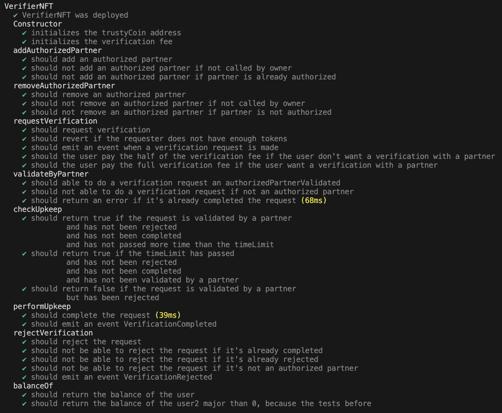
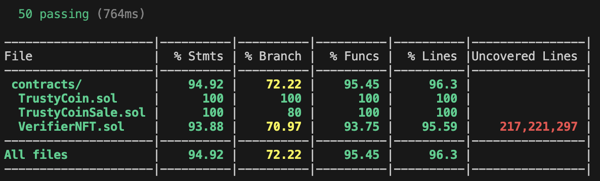

# Trusty hardhat smart contract

## Description

This project implements a credential verification system using smart contracts on the Ethereum blockchain. Users can request verifications of their credentials, which can be validated by authorized partners. If a verification is not responded to within 5 days, it will be automatically completed. The system uses ERC20 tokens (`TrustyCoin`) for payment of verification requests.

## Contracts

### TrustyCoin

An ERC20 contract representing the fungible token used to pay for verification requests.

### VerifierNFT

An ERC721 contract representing credential verifications as NFTs. This contract interacts with `TrustyCoin` for payment management and uses Chainlink Automation (formerly Chainlink Keepers) for automating verifications.

### TrustyCoinSale

A contract to buy `TrustyCoin`

## Installation

1. Clone the repository:
```bash
git clone https://github.com/AldoRed/trusty-hardhat-smart-contract
cd trusty-hardhat-smart-contract
```

2. Install dependencies:
```bash
yarn
```

## Tests

```bash
yarn hardhat test
```

<center></center>

<center></center>

<center></center>

## Coverage

```bash
yarn hardhat coverage
```
<center></center>